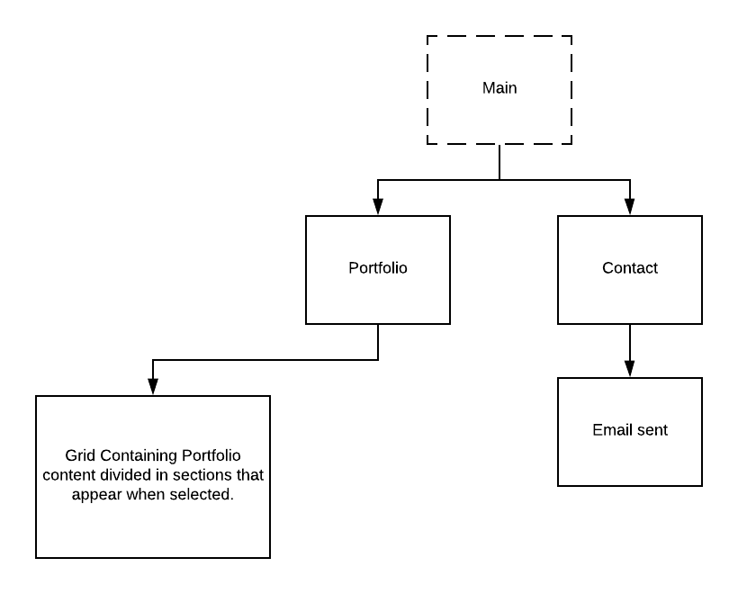
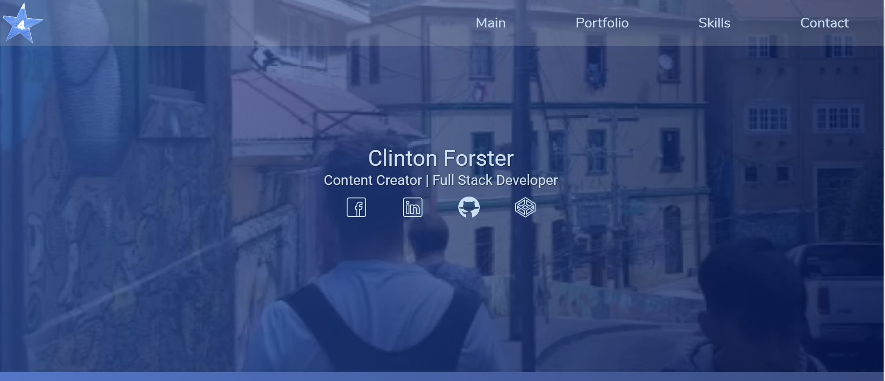
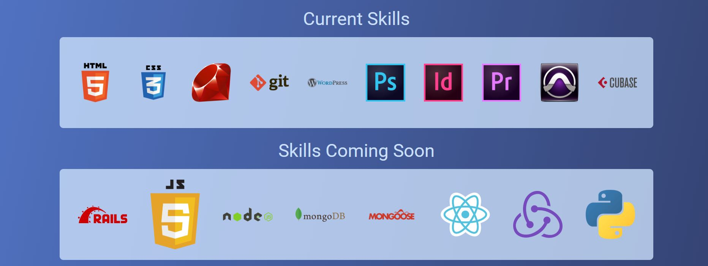
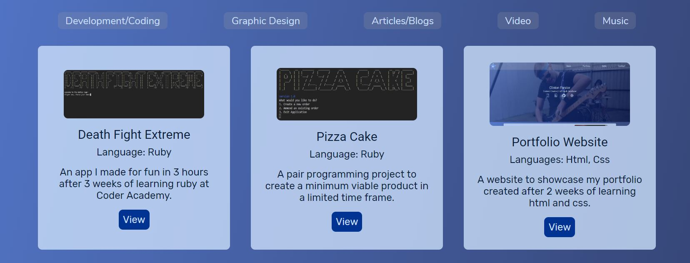
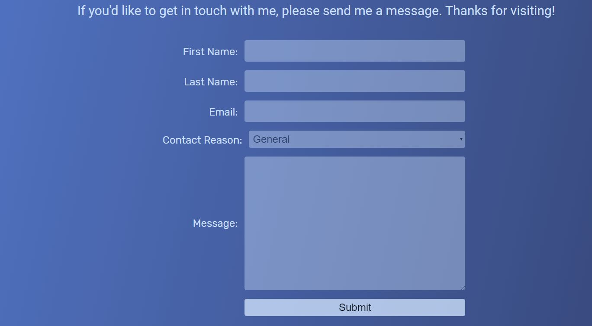
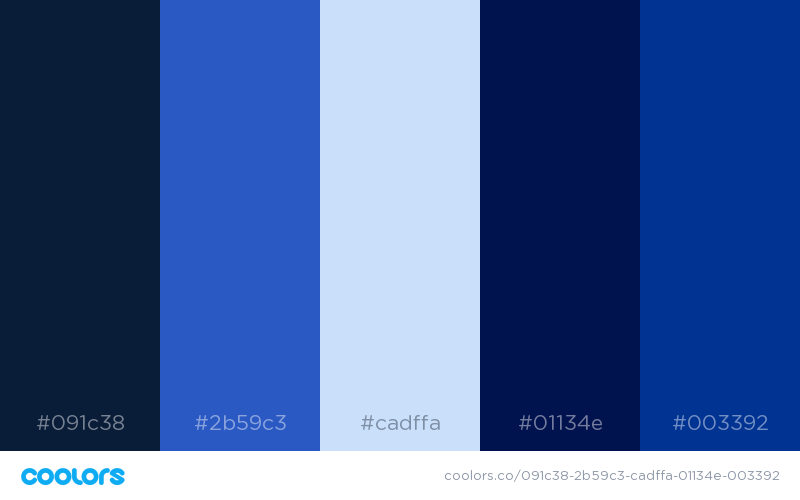
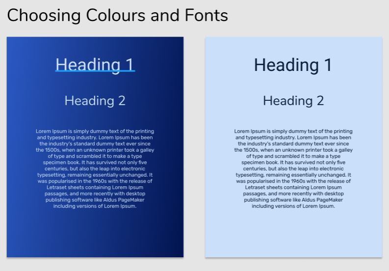
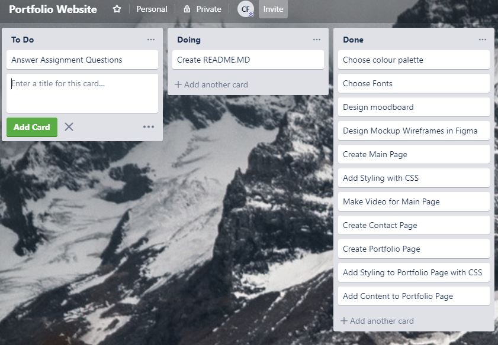

# Portfolio Website

## Created By
|[]
https://github.com/The4Star 
|-----------|
| Clinton Forster | 

## Link

Deployed Site: https://the-4star-045711.netlify.com/

Github Repository: https://github.com/The4star/portfolio

## Purpose

The Purpose of my portfolio is to showcase various projects that i have worked on and content that I have created. People interested in using my services can also see the skills that i have developed and am still developing. 

## Functionality and features

* The Site's theme and content are all created from scratch by myeself.
* Main page features a background video with an overlay colour.
* Subtle animations are featured to highlight content and to make transitions between sections smooth but are not overbearing and do not become the central focus of the page. 
* The colour scheme chosen is consistent throughout the entire site. 
* Css Grid and Flex are used consistently through the site to make sure content is positioned properly.
* All content is fully mobile responsive and can be viewed comfortably on any device. 

#Sitemap
The Sitemap is relatively simple as all the portfolio content appears on the same page if selected:

## Screenshots 

The main page of the site including menu and video background:

The skills section of the website made in grid:

The Portfolio Selector made of of Radio buttons which make the selected content appear with an animation:

The Contact Form:

Footer:

## Target Audience

The Target audience for my portfolio is anyone looking for a full stack developer and content creator.

## Tech Stack

HTML & CSS are the only languages used to make this site meaning I had to be creative to achieve the layout that i wanted. 

## Design Process

I began the process of making my design by first choosing the colours: 

I then chose the fonts:

The central them of my design is the fact that I love the colour blue which becomes quite clear to most people that meet me. The colour scheme also had to resonate with my logo: 

Finally I created the design mockup in Figma:

Figma Link: https://www.figma.com/file/gCn3gJpHz1IRFWgZJSjTH7ju/Portfolio-Website-Design?node-id=0%3A1

## Planning Process and Timeline

I was given a week and a half to design and create my portfolio page and used Trello to keep track of my progress: 

## Short Answer Q&A

1. Describe key events in the development of the internet from the 1980s to today (max. 150 words)

A: The internet has come a long way in a very short since the 1980s and there are some key events that have led to the internet we now know. The first big breakthrough was the invention of the TCP/IP protocol which was created in 1974 but didn't become commonly used until the 1980s. This was a standard way of formatting packets so that computers could communicate easily with each other. Computers then needed an easy way to identify addresses instead of storing them in a giant list which led to the invention of DNS. The final key to the puzzle was the use creation of the hypertext transfer protocol which is the primary way of navigating the internet using hypertext. Once the internet was commercialised in the 90’s, it’s ease of navigation thanks to these events meant that it’s popularity exploded and it is used the world over today.  

2. Define and describe the relationship between fundamental aspects of the internet such as: domains, web servers, DNS, and web browsers (max. 150 words)

The internet is a series of computers around the world that are able to communicate with each other over a network. When an end user, or client tries to access a domain, if the computer is unable to find the domain locally it sends a query to the client’s internet service provider. If the ISP cannot find the domain in its local cache it will send a request to the root server which identifies where the query needs to be sent based on the top-level domain (.com, .net or .org) and directs the query to the top level domain server. This server then directs the query to the authoritative name server which is responsible for all the details of the domain. It  will respond with the IP address and send it back to the client computer allowing it to retrieve the webpage and store the IP address in it’s cache. 

3. Reflect on one aspect of the development of internet technologies and how it has contributed to the world today (max. 150 words)

A: One of the most interesting developments in the internet world would have to be the 3g, 4g and soon to be 5g networks that allow us to access the internet from almost anywhere in the world from the palm of our hand. We now have access the the complete collective knowledge of the human race in almost any location which is such an incredibly powerful tool to have at our displosal. Being able to almost instantly check a fact, find out where you're going or find out a rating for a restaurant makes a massive impact on how we interact with the world around us and is something that should not be taken for granted. 